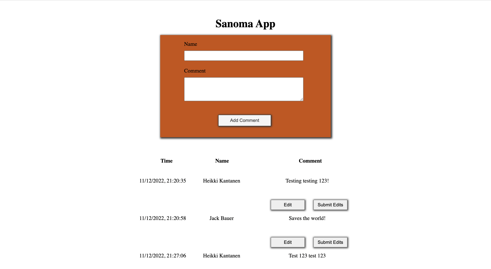
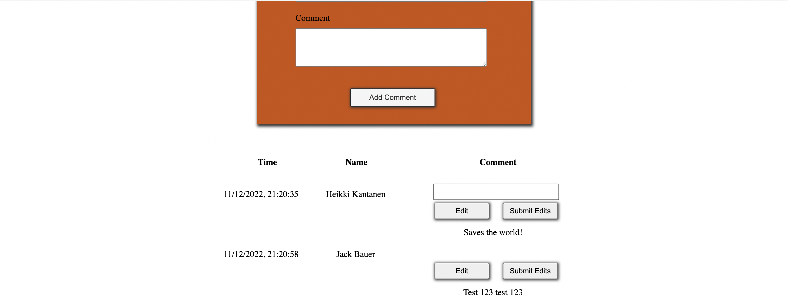
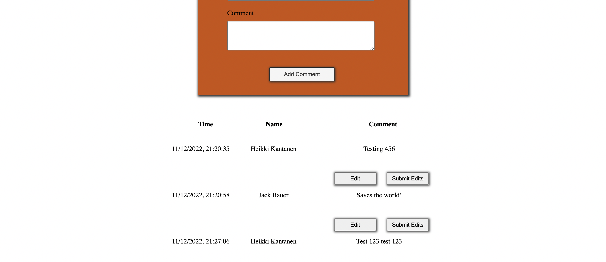

# Sanoma App

## Description:

- Simple application made for Sanoma as a coding assignment. With this application user can add and edit comments. The application lists all the previous and new comments underneath the form. Visible is also the date and time when the comment was inserted and the name of the person who made the comment.
- Made with HTML, CSS and React.

## Instructions of use:

### This project is hosted in netlify so you can just access it via the link on the right hand side or you can run the project locally.

### Run the project locally

1. You can clone or fork this project to your local device.

2. Open the folder in your code editor and navigate to the folder in your terminal.

3. Install node_modules.

```shell
> npm install
```

4. To run the application in your browser, type the following command on in your terminal:

```shell
> npm start
```

### After these steps you should see this kind of view in your browser.



## Screenshots:

### Screenshot of editing one of the comments



### Edited comment


